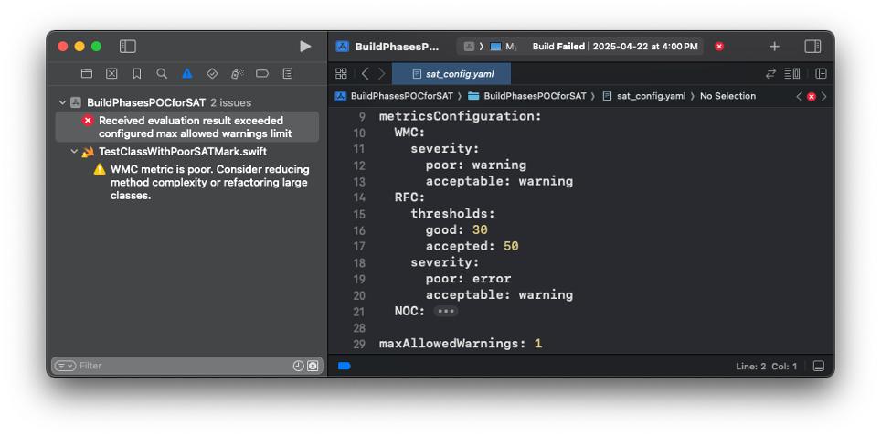

# StabilityAssuranceTool


[](https://opensource.org/licenses/Apache-2.0)


StabilityAssuranceTool is a Swift Package Manager (SPM) tool designed to provide quality checks for Swift projects. 

It offers various metrics to evaluate the stability and quality of Swift codebases.

## What's New in 2.0.0

Version 2.0.0 is a major overhaul focused on automation, flexibility, and deeper integration into the development workflow.

- **Xcode Build Phase Integration**: The tool can now run automatically with every project build, providing immediate feedback directly in the Xcode Issue Navigator and highlighting problematic code in the editor.

- **Flexible YAML Configuration**: Analysis is now controlled via a `sat_config.yaml` file. You can enable/disable metrics, set custom thresholds, and define severity levels (warning or error) to tailor the tool to your project's specific needs.

- **New Metric (LOCM)**: Added the Lack of Cohesion of Methods (LOCM) metric, a key indicator from the Chidamber & Kemerer metrics suite, to better assess class design.

- **Hybrid Architecture**: The tool now ships as a hybrid SPM package, featuring a powerful executable for full access during Build Phase scripts and a convenient Command Plugin for manual terminal-based use.

- **Performance Optimization**: Metric calculations are now performed in parallel using Swift Concurrency, significantly speeding up analysis on multi-core processors.

- **Improved Robustness**: The parsing mechanism, built on [SwiftSyntax](https://swiftpackageindex.com/swiftlang/swift-syntax/601.0.1/documentation/swiftsyntax), has been enhanced to analyze available source code without failing on missing dependencies, making it more reliable for complex projects.

## Features

- **Software Metrics**: Provides classic object-oriented metrics like Weighted Methods per Class (**WMC**), Response For a Class (**RFC**), Number Of Children (**NOC**), and the newly added Lack of Cohesion of Methods (**LOCM**) to assess code stability and complexity.

- **Configurable Quality Gates**: Define custom thresholds for each metric and specify whether a violation should be treated as a warning or a build-breaking error, perfect for CI/CD integration.



- **Immediate Feedback**: Integrates with Xcode's Build Phases to display analysis results as native warnings and errors, allowing developers to address issues without leaving the IDE.

- **Command-Line Interface (CLI)**: Offers a command-line interface for manual analysis or integration with custom scripts.

## Installation

To use StabilityAssuranceTool in your Swift project, add it as a dependency in your `Package.swift` file:

```swift
dependencies: [
    .package(url: "https://github.com/andrellaflame/StabilityAssuranceTool.git", .upToNextMajor(from: "2.0.0"))
]
```
## Usage

The primary way to use the tool is by integrating it into your Xcode project's build process.

#### Step 1: Xcode Build Phase Integration (Recommended)

1. In Xcode, navigate to your target's Build Phases.

2. Add a New Run Script Phase.

3. Add the following script. This script will run the analyzer on every build and use the configuration file from your project's root directory.

```Bash
# sat_run_script.sh

# Fails the build if the number of warnings exceeds the configured limit.
if [ "${TARGET_NAME}" == "YourAppTargetName" ]; then
    if which sat >/dev/null; then
        sat evaluate "${PROJECT_DIR}" --config "${PROJECT_DIR}/sat_config.yml"
    else
        echo "warning: StabilityAssuranceTool not installed"
    fi
fi
```

#### Step 2: Create a Configuration File

Create a `sat_config.yml` file in your project's root directory to control the analysis.

Example:

```YAML
# sat_config.yaml

# Optional: Define an output path for a report file.
output: "build/sat_report.txt"

# Enable or disable specific metrics.
enabledMetrics:
  - "WMC"
  - "RFC"
  - "NOC"
  - "LOCM"

# Configure thresholds and severity for each metric.
metricsConfiguration:
  WMC:
    severity:
      poor: warning
      acceptable: warning
    thresholds:
      good: 30
      accepted: 50
  NOC:
    severity:
      poor: error
      acceptable: warning
    thresholds:
      good: 5
      accepted: 10

# Set a total number of warnings allowed before the build fails.
maxAllowedWarnings: 1
```

#### Command Line Usage

You can also run the tool manually from the terminal.

```Bash
$ swift run sat evaluate <path_to_your_project> --config <path_to_config_file>
```

- ```test``` (default): Test command to demnstrate the work of SPM tool.
- ```showData```: Show collected data for the specified filepath.
- ```evaluate```: Evaluate the stability of the source code for the specified filepath.
    
> **Important:**
>
> The evaluate command has been expanded to include dedicated subcommands for each software metric. This allows for granular analysis of specific code quality aspects.

> Example usage: 
>
> ```$ swift run sat test```


> ```$ swift run sat evaluate "file_path"```


## Documentation

- **Swift Argument Parser**: Documentation for the Swift Argument Parser library used for building the command-line interface.
- **SwiftSyntax**: Documentation for the SwiftSyntax library used for parsing Swift code.
- **StabilityAssuranceTool**: Documentation is available in `Developer Documentation`.
- **Research and Publication**: [Full published research](https://ekmair.ukma.edu.ua/handle/123456789/32021)

## License

This project is licensed under the [Apache License 2.0](./LICENSE). 

### Intellectual Property Notice

The algorithms and architecture used in this project are the original work of Andrii Sulimenko.

Although not covered by a formal patent, any reuse, modification, or distribution of this work must include attribution.  

Unauthorized patenting of this work or its derivatives is strictly prohibited.

> © 2023 Andrii Sulimenko. 
